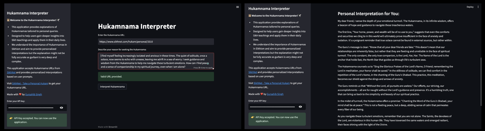

# Hukamnama Interpreter

## Overview
In Sikhism, a Hukamnama is revered as the Guru's message to the individual or the Sangat (holy congregation). Inspired by a wonderful resource provided by SikhNet, which allows anyone to receive a personal Hukamnama online - [SikhNet - Take a Personal Hukam](https://www.sikhnet.com/hukam/personal?gad_source=1&gclid=CjwKCAjwrcKxBhBMEiwAIVF8rNRrcM0Up7TdXJfZ43usPpdl0NPDbT-QIC3YGCI0ALk81S-cbdER5BoCAAsQAvD_BwE), many seek guidance through these divine words during times of joy and sorrow, finding peace and contentment in the process.

However, it has come to my attention through conversations with the Saadh Sangat (holy people) and other users that while many receive the Hukamnama, applying its profound teachings to their personal circumstances can be challenging. Gurbani, the religious scripture of Sikhism, possesses a beautifully deep and abstract quality. Its meanings are vast and can be shaped by interpreters to fit the specific reasons behind seeking the Hukamnama. Yet, the complexity of Gurbani in its original languages (Gurmukhi or Punjabi) can be a barrier to understanding for those not well-versed in these languages.

To bridge this gap, I have developed an intuitive application using advanced Language Learning Models (LLMs). This tool interprets the Bani and translates the Guru’s teachings into simple, plain English. It is my sincere hope that this endeavor, this sewa (service), proves beneficial in helping individuals connect more deeply with the teachings of the Gurus.

## Features
- **Hukamnama URL Input**: Users can input a URL from Sikhnet to fetch a specific Hukamnama.
- **Query Input**: Users can describe their personal reason or issue for which they are seeking guidance from the Hukamnama.
- **Groq API Integration**: Utilizes Groq's LLM to generate insightful responses that interpret the Hukamnama in the context of the user's input.

## Prerequisites
Before you begin, ensure you have the following:
- Python 3.6 or higher
- pip (Python package installer)

## Installation

### Clone the Repository
First, clone this repository to your local machine using:
```bash
git clone https://github.com/Singh-Gursahib/hukamnama-interpreter.git
cd hukamnama-interpreter
```

### Install Dependencies
Install the necessary Python packages specified in `requirements.txt`:
```bash
pip install -r requirements.txt
```

### API Key
You will need an API key from Groq to use their language model. Obtain an API key from your Groq account and keep it ready to enter in the application's UI. At the time of creation, creatng a new key is free of cost.

[groq](https://console.groq.com/keys)

## Usage

### Run the Application
To start the application, run:
```bash
streamlit run app.py
```

### Using the Application

Navigate to `http://localhost:8501` in your web browser (Streamlit should automatically open this page when you run the application).

Here’s what you need to do next:
1. **Enter the API Key**: Input your Groq API key when prompted in the sidebar.
2. **Input the Hukamnama URL**: Ensure the URL is from the designated Sikhnet page.
3. **Describe Your Query**: Enter your personal spiritual query or context for which you need guidance.
4. **Interpret Hukamnama**: Click the 'Interpret Hukamnama' button to receive your personalized guidance.




## Contributing
Contributions to the Hukamnama Interpreter are welcome. Please feel free to fork the repository, make changes, and submit pull requests. I too have many future plans and perhaps as a community could make this help many.

## Acknowledgements
This project uses the Groq API for processing natural language. Thanks to Sikhnet for providing access to Hukamnamas.

## Contact
For any queries or further information, please do not hesitate to reach out. You can contact me through my LinkedIn profile:

- [Gursahib Singh on LinkedIn](https://www.linkedin.com/in/Singh-Gursahib/)

Made with ❤️ by Gursahib Singh.


